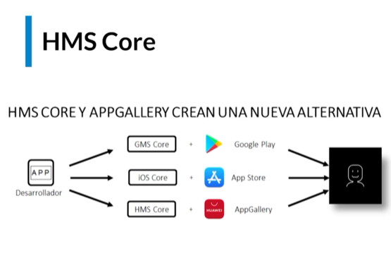
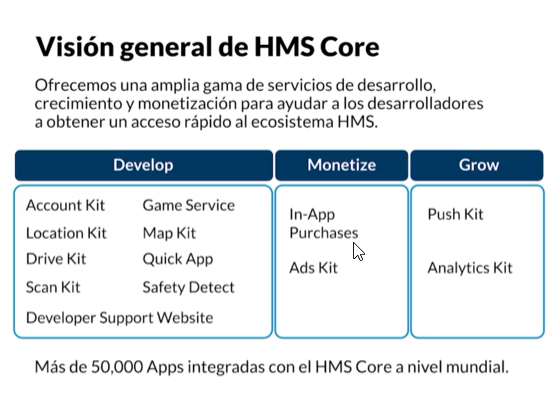
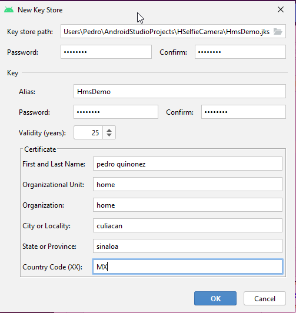
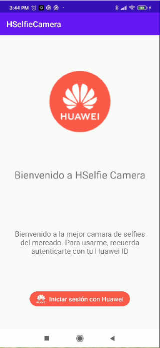
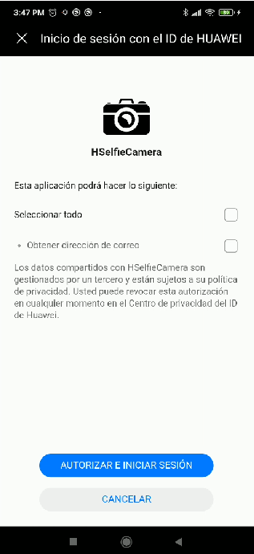
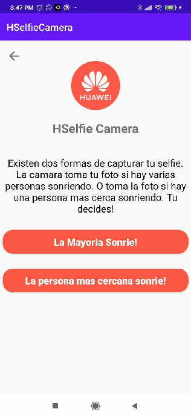

Crear cuenta en huawei: https://developer.huawei.com/consumer/en/console#/serviceCards/ (puede tardar de 1 a 3 dias en habilitar la cuenta)

Crear app en huawei: https://developer.huawei.com/consumer/en/service/josp/agc/index.html#/myApp (debe tener el mismo nombre que nuestro proyecto)

**Ambientar proyecto con los servicios de huawei:**

Generar una llave en el proyecto:
 - Build -> Generate Signed Bundled / Apk
 - Seleccionar Apk
 - Create new
 - llenar el formulario y en la key store path ponerlo en la app del proyecto
 - guardamos

Generamos el SHA-256
 - entramos en el directorio jdk de java donde lo tengamos instalado 
 - entramos en el directorio bin
 - en la linea de comandos tecleamos keytool -list -v -keystore {ruta del proyecto}/app/{nombre del key que creamos}.jks
 - esto va generar un SHA-256 lo copiamos y lo pegamos en la pagina https://developer.huawei.com/consumer/en/service/josp/agc/index.html#/
 - nos vamos a proyectos, seleccionamos el nuestro
 - en la pestaña de opciones del proyecto en la parte de abajo pegamos nuestro SHA donde dice SHA-256 certificate fingerprint
 - damos click a la palomita para guardarlo
 - descargamos el agconnect-services.json y lo ponemos el carpeta app de nuestro proyecto
 
**Instalar servicios huawei en el celular para que funcione la aplicacion**

Instalar App Gallery y HMS Core : https://huaweimobileservices.com/es/appgallery-esp/

*Pantallazos*

